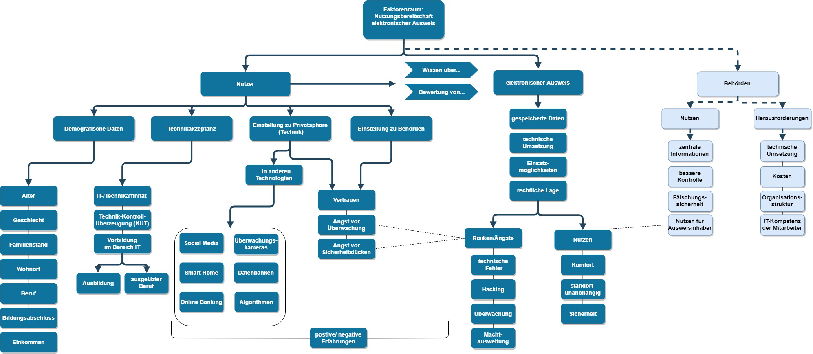

# Privacy-in-Beh-rden

Wir gehören zur Gruppe "Smartidentification" und haben das Thema "Privacy in Behörden".

Nachdem wir verschiedene Literaturquellen gesichtet haben entschieden wir uns dafür Privacy in Bezug auf die "Electronic Identity Card" (eID) zu untersuchen. 

Die Forschungsfrage, die wir uns überlegt haben lautet wie folgt:

Welche Nutzerfaktoren beeinflussen die Nutzungsbereitschaft einer electronic Identity Card (eID)? 

Dazu haben wir bereits einen Faktorenraum erstellt 