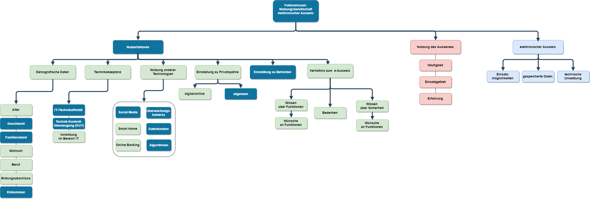

# Privacy-in-Beh-rden - Vorstellung

Nutzungsbereitschaft des elektronischen Ausweises

Wir gehören zur Gruppe "Smartidentification" und haben das Thema "Privacy in Behörden". Zu diesem Thema wollen wir uns mit dem elektronischen Ausweisen beschäftigen (eID).

Teammitglieder

Julia Arndt
Morena Blaijc
Anna Leblanc
Bianca Nießen
Arlinda Ujkani

# Forschungsfrage

Welche Nutzerfaktoren beeinflussen die Nutzungsbereitschaft einer electronic Identity Card (eID)? 

# Literaturrecherche

Die Ergebnisse der Literaturrecherche zum Thema "Electronic Identity Card" wurden in einer Excel-Liste gesammelt.

Hier eine Zusammenstellung der wichtigsten Quellen:

Hölzl, Michael; Roland, Michael; Mayrhofer, Rene: Real-world Identification for an Extensible and Privacy-preserving Mobile eID. Privacy and Identity Management. The Smwart World Revolution - International Summer School, 2017.

Juels, Ari; Molnar, David; Wagner, David A.:Security and Privacy Issues in E-passports - First International Conference on Security and Privacy for Emerging Areas in Communications Networks, 2005.

Xiao, Qinghan; Savastano, Mario: An exploration on security and privacy issues of biometric smart ID cards - IEEE SMC Information Assurance and Security Workshop, 2007.

Yeow, Paul H.; Loo, W.H., Chong: Malaysian's acceptance towards the multipurpose smart national identity card and driving license - Multimedia University, 2006.

# Faktorenraum 1.0

<<<<<<< HEAD
Dazu haben wir bereits einen Faktorenraum erstellt.

Der erste Faktorenraum ist mit Absicht sehr weit gefasst. Er deckt verschiedene Faktoren hab, die allgemein die Nutzung eines elektronischen Ausweises von Seiten verschiedener Parteien beeinflussen könnten. Neben dem Nutzer wird auch die Behörde als Fakor berücksichtigt.

 

# Faktorenraum 1.1

Die aktualisierte Version des Faktorenraums berücksichtigt, dass nur Faktoren auf Seiten der Nutzer erhoben werden, da im weiteren Verlauf keine Befragung von Behörden stattfinden wird. Außerdem unterscheidet sie zwischen Nutzerfaktoren (blau) und der abhängigen Variable, der Nutzung des Ausweises (rot). Besonderes wichtige Nutzerfaktoren sind grün markiert. Noch nicht klar entschieden ist, ob die verschiedenen Eigenschaften des Ausweises auch einen Faktor darstellen, oder ob nur mit Eigenschaften des deutschen elektronischen Ausweises gearbeitet wird, dieser faktor also konstant bleibt.

 

# Fragebogen

Nun haben wir unseren Fragebogen auf Survey Monkey gegliedert und bei dem Demografischen Daten schon Fragen formuliert. Im nächsten Schritt wird jeder aus der Gruppe sich zu einem Gliederungsfaktor Fragen und die Art der Antwortmöglichkeit überlegen. Die Aufteilung folgt. 
<<<<<<< HEAD
>>>>>>> 59c0097361edefb6e4651d825e679500f31ff279
=======

# Forschungsstand 30.11.2018 - Entwicklung der ersten drei Hypothesen:

Hypothese 1:

Personen mit höherer Technikakzeptanz nutzen haeufiger bereits die eID/beabsichtigen häufiger, sie in nächster Zeit zu nutzen.

H1:Personen, die eine aktivierte eID haben, weisen eine höhere Technikakzeptanz auf als Personen mit nicht aktivierter eID.

H0: Es gibt keinen Unterschied in der Technikakzeptanz zwischen Personen mit aktivierter eID und Personen mit nicht aktivierter eID.

Hypothese 2:

Personen mit hoehererm Wissensstand über die eID haben eine positivere Haltung gegenueber der eID.

(Kommentar: Da wir beides in Skalen erfassen, handelt es sich hierbei um eine Zusammenhangy-Hypothese. Für den T-Test ist sie nicht geeignet.)

H2: Besitzer einer aktivierten eID haben ein höheres Wissen über die eID, als Besitzer einer nicht aktivierten eID.

H0: Es gibt keinen Unterschied im Wissensstand über die eID zwischen Personen mit aktivierter und Personen mit nicht aktivierter eID.

Hypothese 3: 

Personen, die nicht zentral in einer Stadt leben, sind eher dazu bereit, die eID zu nutzen.

--> H3: Personen, die auf dem Land leben, beabsichtigen stärker die eID in nächster Zeit zu nutzen, als Personen, die zentral in einer Stadt wohnen.

H0: Es gibt keinen Unterschied in der Absicht in nächster Zeit eine eID zu nutzen zwischen Personen mit aktivierter und Personen mit nicht aktivierter eID.

# Hinweise zum Umgang mit P-Values.

Der P-Wert (in R p-value) beschreibt eine Wahrscheinlichkeit. Das gängige Signifikanzniveau beträgt p=0.05. Das bedeutet, dass bei p > 0.05 wird die H0 behalten und bei p < 0.05 wird diese zugunsten der H1 verworfen. Wichtig ist, dass der P-Wert nicht direkt die Wahrscheinlichkeit für einen Alphafehler ist, sondern die Wahrscheinlichkeit für unsere Daten (oder extremere), wenn die H0 wahr ist. Dennoch hat der P-Wert eine hohe Relevanz, da er immer eine Aussage über die Daten trifft, jedoch nicht über den Wahrheitsgehalt der entworfenen Hypothesen. Er liefert also eine erste Antwort auf die Fragen: Wie gut „passen“ unsere Daten zur Nullhypothese? vs. Wie wahrscheinlich ist die Richtigkeit der Alternativhypothese?.

Für weitere Infos eignen sich folgende Quellen:

http://www.perfendo.org/docs/BayesProbability/twelvePvaluemisconceptions.pdf

http://blog.minitab.com/blog/adventures-in-statistics-2/not-all-p-values-are-created-equal
<<<<<<< HEAD
>>>>>>> 0a88476d356c5a7526fc63c530a5631eb05de6c4
=======

# Forschungsstand 21.12.2018 - Drei Zusammenhangshypothesen + dazugehörige Nullhypothese

1. Zusammenhangshypothese - KUT und DIG_TECH

Hypothese: Je höherer der KUT, desto höher der DIG_TECH
H0: Es gibt keinen Zusammenhang zwischen KUT und DIG_TECH

--> Berechnung des Korrelationskoeffizienten nach Spearman (da Vorraussetzung für Pearson Korrelation noch nicht prüfbar sind):

2. Zusammenhangshypothese - AGE und USE_TECH

Hypothese: Je älter der Mensch, desto niedriger der USE_TECH
H0: Es gibt keinen Zusammenhang zwischen AGE und USE_TECH

--> Berechnung des Korrelationskoeffizienten nach Spearman (da Vorraussetzung für Pearson Korrelation noch nicht prüfbar sind):

3. Zusammenhangshypothese - TRUST_TECH und TRUST_AUTHORITY

Hypothese: Je mehr man Technologien vertraut, desto eher vertraut man Behörden
H0: Es gibt keinen Zusammenhang zwischen TRUST_TECH und TRUST_AUTHORITY

--> Berechnung des Korrelationskoeffizienten nach Spearman (da Vorraussetzung für Pearson Korrelation noch nicht prüfbar sind):

# Forschungsstand 09.01.2019 - Datenerhebung

Wir haben am 07.01.2019 unsere Befragung erfolgreich abgeschlossen. 

# Aufstellen weiterer Hypothesen

Beim Aufstellen der ersten Hypothesen im Seminar während des Semesters hatten wir teilweise aus den Augen verloren, dass sich die Hypothesen auf die Forschungsfrage beziehen sollten (Beispiel: Zusammenhang KUT und DIG_TECH).

Andere Hypothesen ließen sich nicht sinnvoll testen, da die gewählte Skala beim Analysieren der Ergebnisse keinen akzeptablen Cronbachs Alpha-Wert aufwies (<0.5).

Wir haben die oben genannten Hypothesen getestet, jedoch auch weitere Überlegungen zu unseren Daten angestellt und diese an hand der vorliegenden Daten untersucht.

Wir haben uns dazu entschlossen, für das Seminar das Ergebnis der folgenden Hypothesen zu berichten:

1) Zusammenhang zwischen der Einstellung zur eID und verschiedenen Nutzerfaktoren.

-	H1.1.: Es gibt einen Zusammenhang zwischen der Einstellung zur eID und der Digitalisierungsaffinität.

-	H1.2: Es gibt einen Zusammenhang zwischen der Einstellung zur eID und dem Vertrauen in Behörden.

2) Unterschiede zwischen den Nutzergruppen mit aktivierter eID und deaktivierter eID

-	H2.1: Die Gruppe der Nutzer mit aktivierter eID und die Gruppe der Nutzer mit deaktivierter eID unterscheiden sich im Mittel in ihrer Digitalisierungsaffinität.

-	H2.2: Die Gruppe der Nutzer mit aktivierter eID und die Gruppe der Nutzer mit deaktivierter eID unterscheiden sich im Mittel in ihrem Vertrauen in Behörden.

# Ergebnisse für die Seminarpräsentation

1) Zusammenhang zwischen der Einstellung zur eID und verschiedenen Nutzerfaktoren.

 Correlation Matrix                                                                                                                   
 ──────────────────────────────────────────────────────────────────────────────────────────────────────────────────────────────────── 
                                     age      KUT       DIG_TECH    TRUST_TECH    TRUST_AUTHORITY    ATTITUDE_EID    SELF_ASSESMENT   
 ──────────────────────────────────────────────────────────────────────────────────────────────────────────────────────────────────── 
   age                Pearson's r        —    -0.086      -0.140        -0.076              0.025           0.060             0.074   
                      p-value            —     0.156       0.020         0.206              0.680           0.324             0.221   
                                                                                                                                      
   KUT                Pearson's r                  —       0.466         0.273              0.115           0.155             0.149   
                      p-value                      —      < .001        < .001              0.058           0.010             0.013   
                                                                                                                                      
   DIG_TECH           Pearson's r                              —         0.444              0.289           0.369             0.181   
                      p-value                                  —        < .001             < .001          < .001             0.003   
                                                                                                                                      
   TRUST_TECH         Pearson's r                                            —              0.502           0.340             0.212   
                      p-value                                                —             < .001          < .001            < .001   
                                                                                                                                      
   TRUST_AUTHORITY    Pearson's r                                                               —           0.404             0.287   
                      p-value                                                                   —          < .001            < .001   
                                                                                                                                      
   ATTITUDE_EID       Pearson's r                                                                               —             0.281   
                      p-value                                                                                   —            < .001   
                                                                                                                                      
   SELF_ASSESMENT     Pearson's r                                                                                                 —   
                      p-value                                                                                                     —   
 ──────────────────────────────────────────────────────────────────────────────────────────────────────────────────────────────────── 

-	H1.1.: Es gibt einen Zusammenhang zwischen der Einstellung zur eID und der Digitalisierungsaffinität.
--> Die Nullhypothese wird zu gunsten der Alternativhypothese verworfen.

-	H1.2: Es gibt einen Zusammenhang zwischen der Einstellung zur eID und dem Vertrauen in Behörden.
--> Die Nullhypothese wird zu gunsten der Alternativhypothese verworfen.

2) Unterschiede zwischen den Nutzergruppen mit aktivierter eID und deaktivierter eID

H2.1: Die Gruppe der Nutzer mit aktivierter eID und die Gruppe der Nutzer mit deaktivierter eID unterscheiden sich im Mittel in ihrer Digitalisierungsaffinität.

	Welch Two Sample t-test

data:  filter(data, which_eID == "Einen eID-fähigen, die Funktion ist aber deaktiviert.")$DIG_TECH and filter(data, which_eID == "Einen eID-fähigen, dessen Funktion ich auch nutze.")$DIG_TECH
t = -0.29243, df = 22.298, p-value = 0.7727
alternative hypothesis: true difference in means is not equal to 0
95 percent confidence interval:
 -0.4727698  0.3558394
sample estimates:
mean of x mean of y 
 4.010285  4.068750 
 
 --> Die Nullhypothese wird beibehalten.
 

H2.2: Die Gruppe der Nutzer mit aktivierter eID und die Gruppe der Nutzer mit deaktivierter eID unterscheiden sich im Mittel in ihrem Vertrauen in Behörden.

	Welch Two Sample t-test

data:  filter(data, which_eID == "Einen eID-fähigen, die Funktion ist aber deaktiviert.")$TRUST_AUTHORITY and filter(data, which_eID == "Einen eID-fähigen, dessen Funktion ich auch nutze.")$TRUST_AUTHORITY
t = -3.5536, df = 28.679, p-value = 0.001338
alternative hypothesis: true difference in means is not equal to 0
95 percent confidence interval:
 -0.8132407 -0.2189112
sample estimates:
mean of x mean of y 
 3.613924  4.130000 
 
--> Die Nullhypothese wird zu gunsten der Alternativhypothese verworfen.

